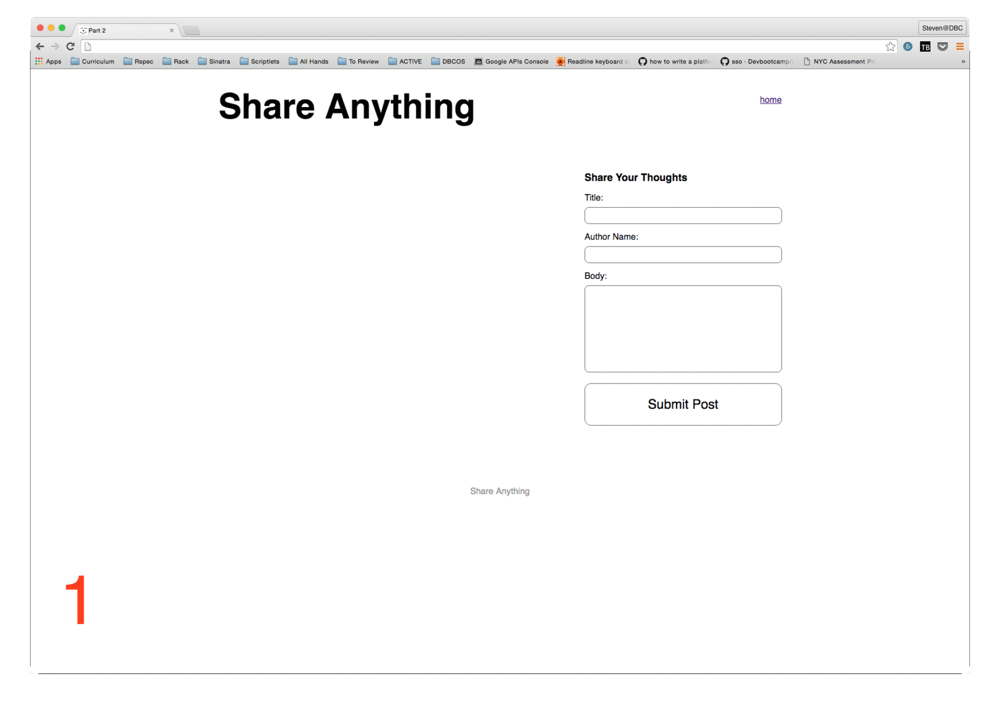
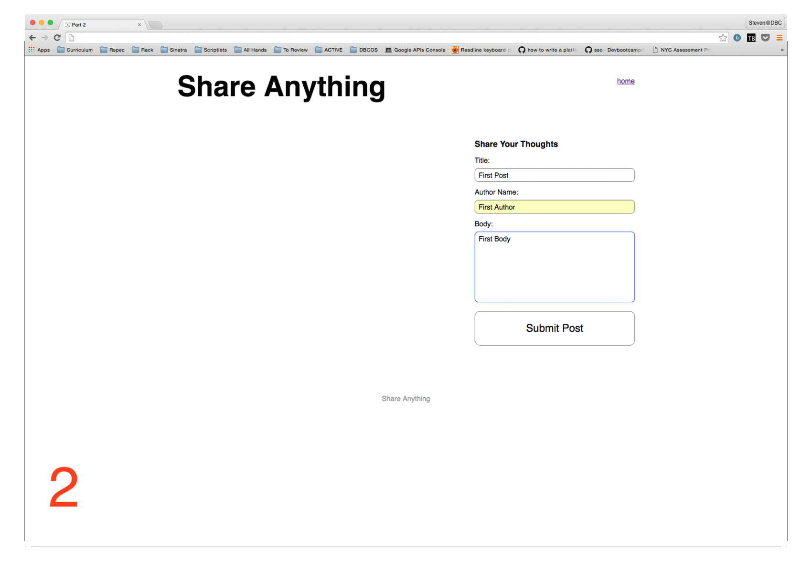
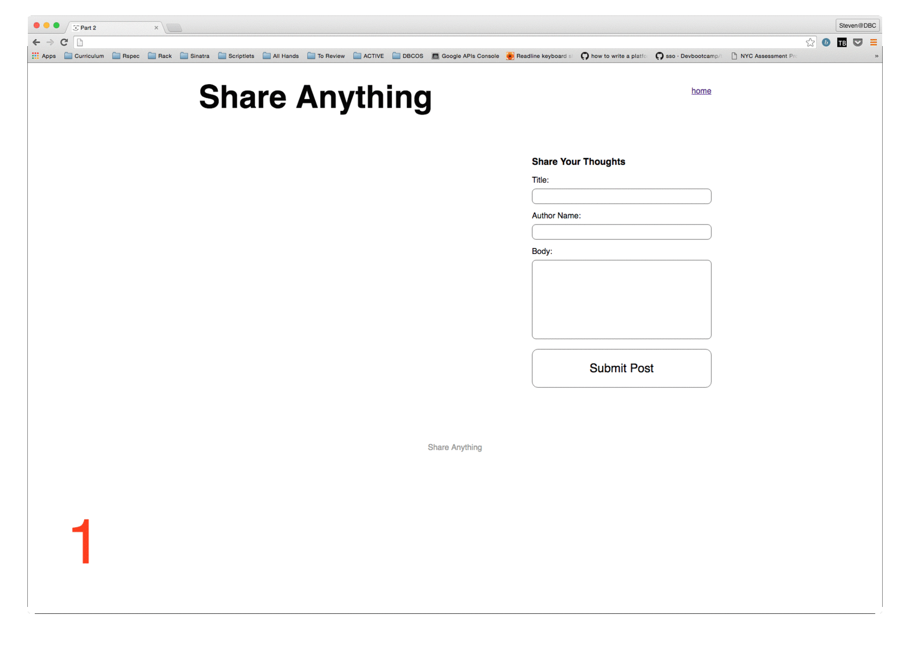
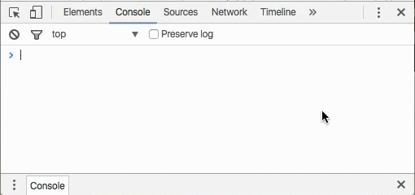

# Part 2:  AJAX

## Summary

In Part 2 we'll take a functioning Sinatra application and enhance the user
experience by adding some AJAX calls.

### User Stories

<a name="current_site">

#### Current Site

The application is a site where users can write posts.  The animated gif here
should provide some demonstration of how this works:

1. **Frame 1**: User visits the site root. All `Post`s are listed in the main
   body of the page. On first visit this will be empty.
1. **Frame 2**: User fills out the form
1. **Frame 3**: User submits the form
1. **Frame 4**: User is redirected to a page that shows the newly-created `Post`.
1. **Frame 5**: User can click on a "Like" button
1. **Frame 6**: Clicking the "Like" button sends data to the server and
   re-renders the page with an incremented "Like" count.

<a name="future-site">

#### Future Site

Our enhancements will make it so the user never leaves the homepage.  All the
requests will be AJAX requests and the DOM will update based on the responses.
After the site is updated, here's what the user experience will be:

1. **Frame 1**: User visits the site root. All `Post`s are listed in the main
1. **Frame 2**: User fills out the form
1. **Frame 3**: User submits the form
1. **Frame 4**: Details of the saved `Post` are added to the DOM (without refreshing). The form is also reset thus allowing another `Post`.

The animated gif here should provide some demonstration of how this works:

##### Liking

In addition to AJAXifying the site, you should use AJAX to enable users to
"like" a post without doing a page redirect. This flow will again keep the user
on the same page and create an enhanced experience.

1. **Frame 1**: User visits the site root.
1. **Frame 2**: User clicks on a like button.
1. **Frame 3**: The "Like" count is incremented by `1` for that `Post` in the DOM.

The animated gif here should provide some demonstration of how this works:

### Design Principle: Graceful Degradation

When adding AJAX to this website, we should ensure that the site still works
the same if JavaScript is disabled. Try disabling JavaScript in Chrome and then
visit the [http://localhost:9393/posts](http://localhost:9393/posts) again.

As a reminder, you can use the Chrome Developer Tools to temporarily disable JavaScript (Version 51.0.2704.106 shown):

With JavaScript disabled you should experience the workflow
described in the "[Current Site](#current_site)."

## Releases

### Release 0: AJAX Post Addition

Implement code to make the page function as described in
[Future Site](#future-site).

### Release 1: Add Liking

Build on work work from Release 0 and add the capability to add a new post _and
then "Like" it_. No refresh of the page should be required to make this
possible.

## Conclusion

Once all the tests have passed, you have completed Part 2 of the assessment. If
you haven't done so already, commit your changes and move on to Part 3.
