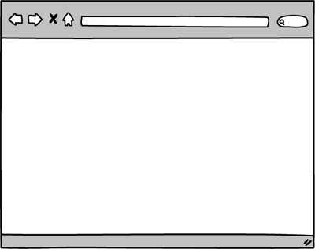
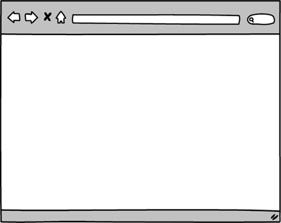
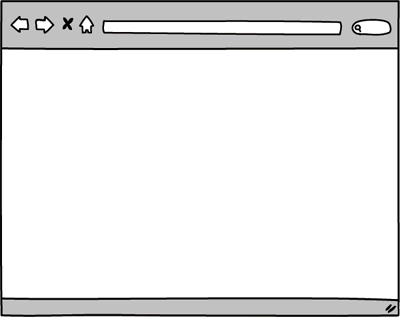
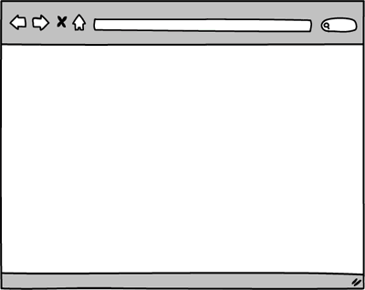

# Part 3: Build a CRUD App

## Summary

In Part 3 of the assessment, you'll build a web-stack application: controllers, views, user authentication, database migrations, model validations, associations, etc.  This is an opportunity to demonstrate your proficiency in the core skills from Phase 2.

### Completing Part 3
Part 3 is the final part of the Phase 2 assessment.  If Parts 1 and 2 are finished, devote the rest of the day to completing as much of this application as possible.  The time allocated for the assessment might end before you've finished all the releases. If time is running out, continue to complete the releases in order and make as much progress as you can.  Use your time wisely:  if you're stuck,  ask questions and get help.

### Web Application Overview
You'll be building a simplified version of a restaurant review site—a much simplified version of Yelp.  Users will be able to register with the site, add restaurants to the site, and provide reviews for restaurants.  We'll build the site one feature at a time.  The requirements for each feature are described in more detail in the *Releases* section.

## Releases
The releases describe features to build out in your web application.  Each release will describe what to build, not how to build it.  Apply best practices.  For example, the releases contain mockups of the application.  In the mockups, the URLs are omitted from the browser's address bar.  You should determine the appropriate path for each page based on the conventions / patterns you've learned in Phase 2.

### Pre-release: Setup
Make sure that everything is set up before we begin working on the application: install any necessary gems and create the database.  From the command line, navigate to the `part-3` directory of the Phase 2 assessment.  Once there, run ...

0. `$ bundle`
0. `$ bundle exec rake db:create`

### Release 0: User Registration
The first feature to build is user registration, which allows users to create new accounts.  What are best practices for user registration?  What routes do you need?  How can you keep user data safe?

On the homepage, add a "register" link.  Clicking the link takes the user to a page with a form for creating a new account.  Users must register with an e-mail address, a username, and a password.  The e-mail address and username must be unique.

If registration is unsuccessful, the user should see the registration form and the associated error messages.  If registration is successful, the user should be considered logged in and redirected to the homepage where the "register" link is replaced with the user's username.  This is demonstrated in Figure 1.

  
*Figure 1*. Registering unsuccessfully and then successfully.

### Release 1: Login/Logout
Now that users can register, allow them to login and logout.  On the homepage, add a "login" link next to the "register" link.  Clicking the link takes the user to a page with a form for logging in.  Users sign in with an e-mail address and password.

If login is unsuccessful, the user should see the login form and an error message.  If login is successful, the user should be considered logged in and redirected to the homepage where the "login" and "register" links are replaced with the user's username and a "logout" link.

Clicking the "logout" link logs the user out and redirects the user back to the homepage.  These behaviors are demonstrated in Figure 2.

  
*Figure 2*. Logging in unsuccessfully, logging in successfully, and logging out.

### Release 2:  Adding Restaurants
Add a feature that allows registered users to add restaurants to the site.  Logged-in users should see an "Add a Restaurant" button on the homepage.  Clicking the button takes the user to a form.  The form should collect data like the restaurant's name, the restaurant's location, and the type of cuisine served.

When the form is submitted, if adding the restaurant is unsuccessful (e.g., failing a validation), the user should see the form and the associated error messages.  If listing the item is successful, the user should be redirected to a page showing the restaurant's details.  Each restaurant should be associated with the user who added the restaurant.  This is demonstrated in Figure 3.

  
*Figure 3*.  Adding a restaurant unsuccessfully and then successfully.

### Release 3:  Browsing Restaurants
Add a feature that lists restaurants.  Restaurants should be listed on the homepage for any visitor to browse.  Each restaurant's name, city, and state should be displayed.  The name should be a link.  Clicking the link takes the user to a page showing the restaurant's details.  This is demonstrated in Figure 4.

  
*Figure 4*. Browsing restaurants and viewing a specific restaurant.

### Release 4:  Editing a Restaurant's Details
Allow users to edit restaurant details.  In the list of restaurants on the homepage, if a user is logged in, the user should see an "edit" link for any restaurants the user added.  Clicking the link takes the user to a form for editing the restaurant.  The form should be populated with the restaurant's current details.  Submitting the form makes a request to update the restaurant.

If the update is unsuccessful, the user should see the form and the associated error messages.  If updating the restaurant is successful, the user should be redirected to a page showing the restaurant's details.  The successful outcome is demonstrated in Figure 5. 

  
*Figure 5*. Successfully editing a restaurant.

### Release 5: Deleting a Restaurant
In the same way that users might need to edit a restaurant, they might also need to delete a restaurant.  Add a feature that allows users to delete restaurants which they've previously added.

In the list of restaurants on the homepage, add a "delete" button next to the "edit" link for any restaurants the user added.  Clicking the button should delete the restaurant and redirect the user back to the homepage.  This is demonstrated in Figure 6.

*Note:* The "delete" button is part of a form used to submit a RESTful request to delete an item.  In Figure 6, it is styled to look like a link.

  
*Figure 6*.  Deleting a restaurant.

###Release 6:  Apply Responsible Behavior Per User and Route
Refine what you've done so far.  In particular, think about how we can provide a good, secure application for users.  Use your best judgement to make any appropriate code changes.  Be prepared to explain why your choices were appropriate.

Consider:
* Who can access the form to add a restaurant?
* Who can access the form to edit a specific restaurant?
* Who can edit a specific restaurant?
* Who can delete a specific restaurant?

### Release 7: Restaurant Reviews
Add a feature that allows logged-in users to review a restaurant.  Adding a review will occur on the page showing the restaurant's details.  On the page add a reviews section.  Include the average review rating and the body of all reviews.  If no user is logged in, inform the user to log in to leave a review.  If a user is logged in, display a form that accepts new reviews.

When submitting the form, if the review is unsuccessfully created, the user should see the restaurant page with the form and the associated error messages.  If the review is successfully created, the user should be redirected to the restaurant's show page.  Instead of seeing a form for writing a new review, the user should see a thank you message.  This thank you message is only visible after creating the new review; later visits to the page should display a message that the user has already left a review.  Writing a review as a logged-in user is demonstrated in Figure 7.

  
*Figure 7*.  Successfully logging in and reviewing a restaurant.

## Conclusion
Part-3 wraps up the assessment.  If you haven't already done so, commit your
changes.  Please wait until the end of the assessment period to submit your
solution.
