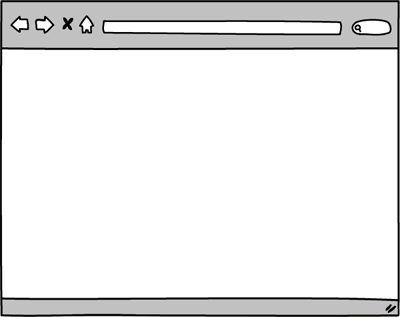
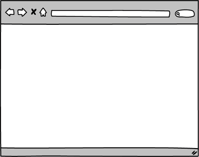
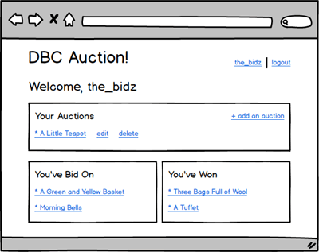

# Part 3: Build a CRUD App

## Summary

In Part 3 of the assessment, you'll build a web-stack application:  controllers, views, user authentication, database migrations, model validations, associations, etc.  This is an opportunity to demonstrate your proficiency in the core skills from Phase 2.

### Completing Part 3
Part 3 is the final part of the Phase 2 assessment.  If Parts 1 and 2 are finished, devote the rest of the day to completing as much of this application as possible.  The time allocated for the assessment might end before you've finished all the releases. If time is running out, continue to complete the releases in order and make as much progress as you can.  Use your time wisely:  if you're stuck,  ask questions and get help.

### Web Application Overview
We'll be building a simplified version of a blind auction site; in a blind
auction, bidders do not see how much other bidders have bid.  Users will be able to register with the site, list items for auction, bid on items, etc.  We'll build the site one feature at a time.  The requirements for each feature are described in more detail in the *Releases* section.

## Releases
The releases describe features to build out in your web application.  Each release will describe what to build, not how to build it.  Apply best practices.  For example, the releases contain mockups of the application.  In the mockups, the URLs are omitted from the browser's address bar.  You should determine the appropriate path for each page based on the conventions / patterns you've learned in Phase 2.

### Pre-release: Setup
Make sure that everything is set up before we begin working on the application: install any necessary gems and create the database.  From the command line, navigate to the `part-3` directory of the Phase 2 assessment.  Once there, run ...

0. `$ bundle`
0. `$ bundle exec rake db:create`

### Release 0: User Registration
The first feature to build is user registration, which allows users to create new accounts.  What are best practices for user registration?  What routes do you need?  How can you keep user data safe?

On the homepage, add a "register" link.  Clicking the link takes the user to a page with a form for creating a new account.  Users must register with an e-mail address, a username, and a password.  The e-mail address and username must be unique.

If registration is unsuccessful, the user should see the registration form and the associated error messages.  If registration is successful, the user should be considered logged in and redirected to the homepage where the "register" link is replaced with the user's username.  This is demonstrated in Figure 1.

  
*Figure 1*. Registering unsuccessfully and then successfully.

### Release 1: Login/Logout
Now that users can register, allow them to login and logout.  On the homepage, add a "login" link next to the "register" link.  Clicking the link takes the user to a page with a form for logging in.  Users sign in with an e-mail address and password.

If login is unsuccessful, the user should see the login form and an error message.  If login is successful, the user should be considered logged in and redirected to the homepage where the "login" and "register" links are replaced with the user's username and a "logout" link.

Clicking the "logout" link logs the user out and redirects the user back to the homepage.  These behaviors are demonstrated in Figure 2.

  
*Figure 2*. Logging in unsuccessfully, logging in successfully, and logging out.

### Release 2: User Profile Page
Now that the application supports users, let's create a page to show a user's profile.  On the homepage, if a user is logged in, make the username a link.  Clicking the link takes the user to the profile page, which for now is a simple page welcoming the user.  This is demonstrated in Figure 3.

  
*Figure 3*.  Logging in and visiting the profile page.

### Release 3: List Items for Auction
Add a feature to allow users to list items available for auction.  Use the profile page for listing a user's items.

On the user profile page, add a link for listing a new item.  Clicking the link takes the user to a form.  The form should collect data like the item's name, the item's condition, and a description of the item.  It should also collect start and end times for the auction.

When the form is submitted, if listing the item is unsuccessful (e.g., failing a validation), the user should see the form and the associated error messages.  If listing the item is successful, the user should be redirected to the profile page where the item is listed by name.  This is demonstrated in Figure 4.

*Note*: To set start and end times for an auction, you'll be working with dates.  The HTML5 datetime input type can be tricky to use with ActiveRecord.  Consider using a text input and entering the times as strings formatted so that ActiveRecord can parse them: `YYYY-MM-DD` or `YYYY-MM-DD HH:MM:SS` (e.g., 2015-04-01 14:30:00).

  
*Figure 4*.  Listing an item unsuccessfully and then successfully.

### Release 4: Updating Items
If a user lists an item, they might wish to later make changes to that item:  change the name, the description, etc.  Let's add a feature, allowing users to edit their items.

On the profile page where a user's auctions are listed, create an "edit" link for each item.  Clicking the link takes the user to a form for editing the item.  The form should be populated with the item's current details.  Submitting the form makes a request to update the item.

If the update is unsuccessful, the user should see the form and the associated error messages.  If updating the item is successful, the user should be redirected to the profile page.  The successful outcome is demonstrated in Figure 5.

  
*Figure 5*. Successfully editing an item.

### Release 5: Deleting Items
In the same way that users might need to edit an item, they might also need to delete an item.  Add a feature that allows users to delete items which they've previously listed.

On the profile page, add a "delete" button next to the "edit" link for each item.  Clicking the button should delete the item and redirect the user back to the profile page.  This is demonstrated in Figure 6.

*Note:* The "delete" button is part of a form used to submit a RESTful request to delete an item.  In Figure 6, it is styled to look like a link.

  
*Figure 6*.  Deleting an item.

### Release 6:  Appropriate Behaviors per User and Route
Refine what you've done so far.  In particular, think about how we can provide a good, secure application for users.  Use your best judgement to make any appropriate code changes.  Be prepared to explain why your choices were appropriate.

Consider:
* Who can access the form to add an item?
* Who can access the form to edit a specific item?
* Who can edit a specific item?
* Who can delete a specific item?
* Who can view a specific user's profile?

### Release 7: Browsing Items
It's time to let users browse the items on our site.  Add a feature that lists the names of items that are currently up for auction and allows users to view a specific item's details.  Only list items for which the auction has started but not finished.  In other words, if the auction hasn't started yet, don't list the item.  If the auction is over, don't list the item.

On the homepage, list the name of each item that is currently up for auction.  The name should be a link.  Clicking the link should take the user to a page showing the details of that item auction.  Show the item's name, condition, and description along with when the auction ends.  This is demonstrated in Figure 7.

  
*Figure 7*.  Viewing an item's details.

### Release 8: Bidding
Add a feature that allows users to bid on items.  Bidding will occur on the page showing an item's details.  

On the page showing an item's details, add a bidding section.  Include the number of bidders for the item and a form that accepts new bids.  When submitting the form, if the bid is unsuccessfully created, the user should see the item page with the form and the associated error messages.  If the bid is successfully created, the user should be redirected to the item's show page.  Instead of seeing a form for placing a new bid, the user should see the details of the bid.  This is demonstrated in Figure 8.

  
*Figure 8*.  Bidding on an item unsuccessfully and then successfully.

### Release 9:  Refine Bidding
In a previous release you controlled for who was able to create, update, and delete items.  Refine bidding in the same way.  Again, you'll need to make choices and be prepared to explain your reasoning.  Use your best judgement to make any appropriate code changes.

Consider:
* Should everyone be allowed to bid or only logged in users?
* Should users be allowed to bid on their own items?
* Should users be allowed to edit or delete their bids?
* Should bids be accepted before an auction starts or after it ends?

### Release 10: Track Bids on the Profile Page
It might be difficult for users to keep track of the auctions in which they've placed bids.  Add a feature for listing (1) the items currently up for auction on which a user has placed a bid and (2) completed auctions that the user has won.

On the user profile page, add two sections:  one for current auctions in which the user has bid and one for completed auctions that the user has won.  In addition, make all names of items links to those items.  This is demonstrated in Figure 9.

  
*Figure 9*.  Profile page showing bin-in and won auctions with links to each item.

## Conclusion

Part-3 wraps up the assessment.  If you haven't already done so, commit your
changes.  Please wait until the end of the assessment period to submit your
solution.
